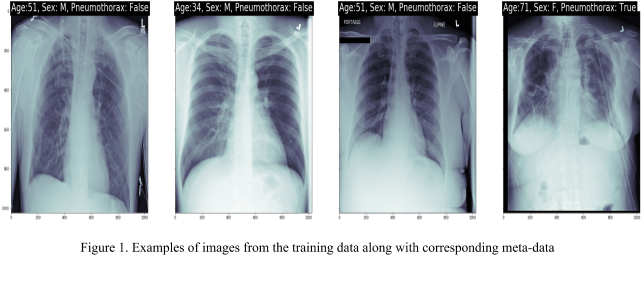
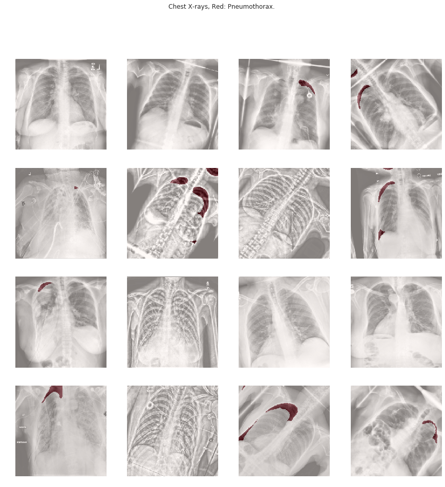

# Pneumothorax-Classification-and-Segmentation

## Introduction

Pneumothorax is the medical term used for a collapsed lung. This medical condition occurs when air leaks into the space between the lung lobe and pulmonary wall. It is a rare condition, there are less than a million reported cases per year in India. Although it is a rare condition and typically resolves within weeks, emergency care is needed. The most common symptoms for a pneumothorax are sudden chest pain and shortness of breath. On some occasions, a collapsed lung can be a life-threatening event.

Pneumothorax is usually diagnosed by a radiologist on a chest x-ray, and can sometimes be very difficult to confirm. An accurate AI algorithm to detect pneumothorax would be useful in a lot of clinical scenarios. AI could be used to triage chest radiographs for priority interpretation, or to provide a more confident diagnosis for non-radiologists.

In this project we present a Computed Aided Diagnosis(CAD) system to classify and if present, segment pneumothorax from a set of chest radiographic images. This problem can be solved by breaking the problem down into smaller subproblems, then these smaller subproblems can be solved easily by relating them to other problems that have been studied in great detail in other domains.
The task undertaken in this project can be broken down into 2 subproblems. Given a high resolution posterior-anterior chest X-ray image as an input, the algorithm needs to correctly classify the presence of pneumothorax. This sub-problem can be seen as a binary supervised learning problem. 
The second sub-problem relies upon the first sub-problem. Given a high resolution posterior-anterior chest X-ray image with at least one instance of visible pneumothorax as input, the algorithm needs to correctly segment the pneumothorax(ces). This problem can be seen as a semantic image segmentation problem.

## Dataset

For experimentation,  the dataset is taken from [Kaggle](https://www.kaggle.com/c/siim-acr-pneumothorax-segmentation/overview), the dataset has over 13,000  Chest X-ray RGB images in Digital Imaging and Communications in Medicine (DICOM) format. DICOM is the standard for the communication and management of medical imaging information and related data. DICOM is most commonly used for storing and transmitting medical images enabling the integration of medical imaging devices such as scanners, servers, workstations, printers, network hardware, and picture archiving and communication systems (PACS) from multiple manufacturers. It has been widely adopted by hospitals and is making inroads into smaller applications like dentists' and doctors' offices.
The dimension of the image in the dataset is 1024x1024.




## Prerequisites

* Python (3.6)
* Keras (2.3.0)
* Tensorflow (2.1)
* NumPy (1.14.3)
* Sklearn (0.22.2)
* Albumentations (0.4.5)
* pandas (0.22.0)
* tqdm (4.19.8)
* opencv-python (3.4.2)
* pydicom (1.4.2)

## Augmentations

Used Albumentations library for image augmentation
```
train_augment = Compose([
    HorizontalFlip(p = 0.5),
    ShiftScaleRotate(p = 0.5),
    ElasticTransform(alpha=120, sigma=120 * 0.05, alpha_affine=120 * 0.03,p = 0.5),
    OneOf([
        RandomContrast(),
        RandomGamma(),
        RandomBrightness(),
         ], p=0.3),
    OneOf([
        RandomSizedCrop(min_max_height=(176, 256), height=256, width=256,p=0.25),
        CLAHE(clip_limit=2.0, tile_grid_size=(32,32),p = 0.4),
         ], p=0.5),
    ToFloat()
])
```


